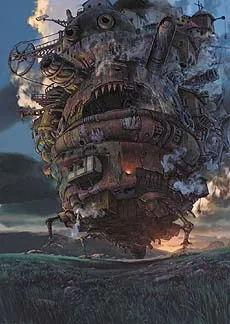

## Original Intention
When someone asks me why I chose computer science, I usually explain that it wasn’t my first choice. My original interest was in architecture. From a young age, I was fascinated by creativity and drawing. In elementary school, I would cut thick cardboard to build houses, sometimes adding whimsical patches that made the final product look nothing like a house, but more like the moving fortress in Hayao Miyazaki’s Howl’s Moving Castle.

However, after gaining a deeper understanding of the architecture field during my freshman year, I realized that with the level of education I was expecting to achieve, I would not be able to get the kind of job I wanted. Many architecture students either end up performing repetitive tasks like machines or eventually switch careers. After reflecting on this for a night, I decided to pursue computer engineering instead. Although the uncertainties in this field are high, I believe that the rapid changes in today’s environment could actually present unique opportunities for me.

## Future
Currently, I hope to move toward the direction of cybersecurity. Since maintaining the security of websites or software requires first understanding the underlying code, only by doing so can one detect and fix vulnerabilities. Although my knowledge of cybersecurity is still limited, I plan to explore it further in my upcoming courses to see if it is truly the field I want to pursue. Even if I eventually decide to shift directions, the knowledge I gain will still become a valuable advantage.

At the moment, I am taking ICS 314 and ICS 311, which are not directly related to security, but they are prerequisites for it. This reinforces my belief that in order to learn how to protect code, I must first understand it thoroughly. That is my current priority and the direction of my learning journey.
