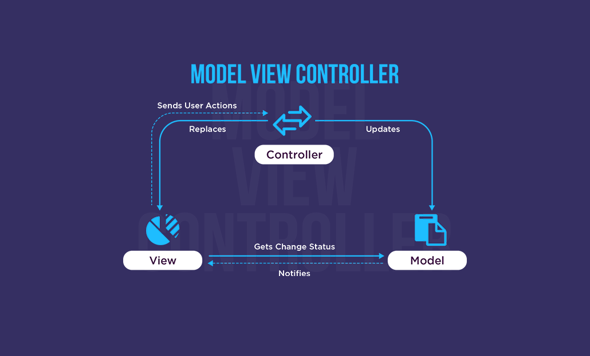

The main purpose of Roomie Match Mānoa is to help students find a compatible roommate. Personality, daily habits, sleep schedule, and even small preferences can all affect the quality of your life. Since this platform was built to support UH students, my original goal for the project was pretty simple: finish the required features and make sure the website works. But as the development process moved forward, I started to realize that the real challenge wasn’t just building the site. What really mattered was making the system clear, maintainable, and easy to extend. And that’s when I began to notice something I had only seen briefly in textbooks before: design patterns.

To be honest, I wasn’t familiar with design patterns at all in the beginning. They sounded like complicated rules that only experienced engineers really understood. But as the project grew, as features increased, and as our team needed to coordinate more closely, I gradually realized that these “patterns” weren’t abstract ideas. They were actually practical ways of thinking—methods engineers have developed over many years of solving similar problems. They’re not something you memorize. They naturally show up when you try to build a system the right way.

For example, the combination of Next.js and Prisma naturally separated our system into data, logic, and user interface. I had heard about MVC before, but I didn’t really understand why it mattered. It wasn’t until I actually worked on the project that I felt the difference: when something broke in the UI, I didn’t have to check the database; when data needed to be updated, I didn’t have to dig through front-end components. Everything had its place, and that clarity helped the project feel much more stable. That was the first time I understood the value of a layered architecture.

Another moment of understanding came from how the system responded to user changes. Whenever a user updated their profile or changed their preferences, different parts of the site needed to reflect those changes right away. At first, I just re-fetched data or re-rendered components, but over time I noticed a deeper idea: the system was basically “watching” for changes, and once something happened, everything that depended on it would update automatically. Later I realized this behavior was similar to the Observer pattern. We never built a formal observer system, but the way React manages state and updates the UI naturally followed that idea.

React’s component structure made this even more obvious. By breaking the interface into smaller pieces, forms, cards, lists, and filters, we didn’t have to rebuild everything from scratch for each page. It kept the code cleaner and made debugging much easier. Even though this is just how React works, I eventually understood that this, too, reflects the spirit of design patterns in real development.

Looking back, we never planned to use any particular design pattern. We were simply trying to break down a complicated problem into something understandable and manageable. And during that process, these patterns showed up on their own, not because we were trying to make the code look impressive, but because they genuinely made the system clearer, more stable, and easier to grow.

Years from now, I probably won’t remember every piece of code I wrote for this project. But I think I will remember the main lesson Roomie Match Mānoa taught us: building software isn’t just stacking features together. It’s about designing a system that can survive changes, grow over time, and still make sense to the people who work on it. And that, to me, is what design patterns are really about.

Note: AI was used only to improve the flow and clarity of the writing.