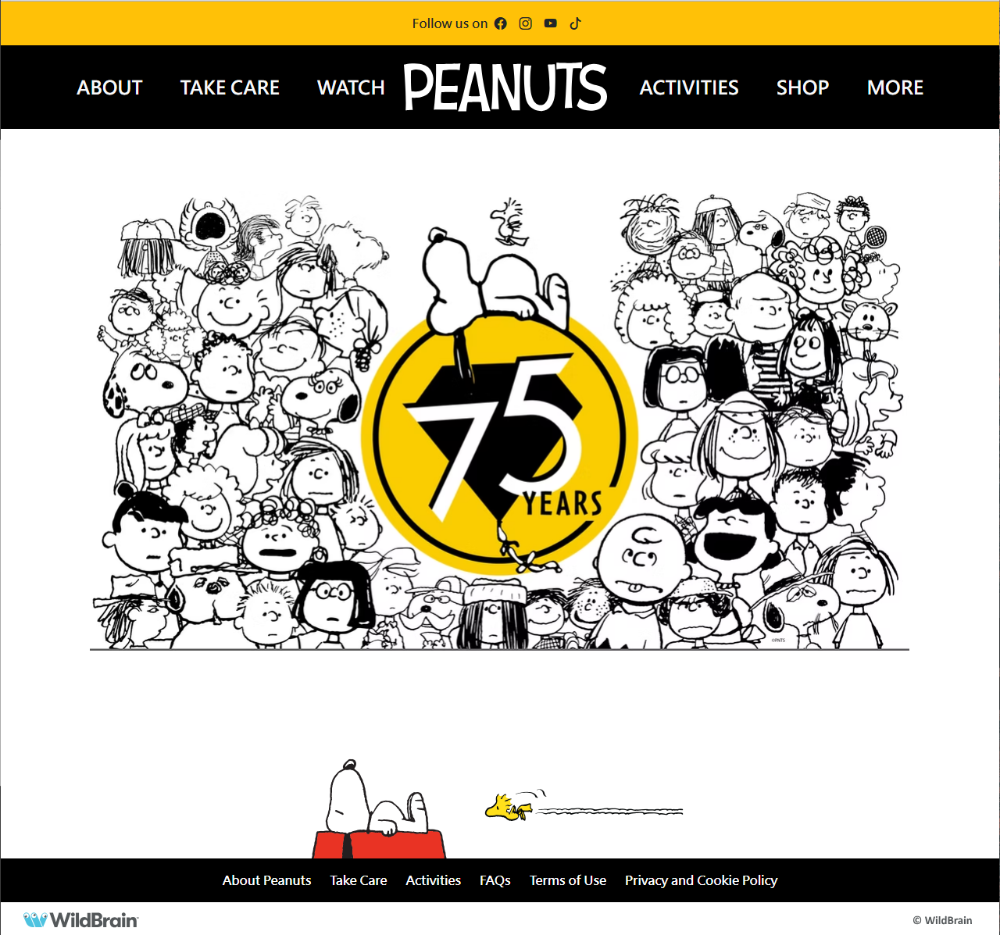

## Without a Framework
Before I started using any frameworks, I always built my websites with plain HTML and CSS. At that time, I thought that as long as I could write a few simple tags like <h1> and 
, I could make a basic webpage that worked.

But I soon realized the problem. As my projects became more detailed and complex, every time I wanted to change the layout, I had to start rewriting my CSS from scratch. If I wanted the website to look right on both phones and computers, I needed to write a bunch of extra code just to make it responsive.

## My First Time Using a Framework
When I first tried Bootstrap 5, that’s when I truly understood how powerful frameworks could be. At the beginning, it was really painful to learn. I had to memorize so many class names like container, row, col, and navbar. These are all CSS classes I would use over and over again, and it honestly felt like I was learning another programming language.

But when I used it to finish my first webpage, I was honestly amazed. The layout automatically aligned itself without me needing to manually adjust anything. I didn’t have to worry about how it would look on different screen sizes, everything just worked. At that moment, I finally understood why so many people recommend UI frameworks.

## Improving Efficiency
After I got more familiar with the framework, the biggest difference I noticed was how much faster everything became, and how much better my websites looked. Before, I could spend an hour just building the most basic layout. Now, things like navigation bars, buttons, and cards are already designed for me. I just need to choose the colors, position them, and fill in the content.

The framework also already takes care of responsive design and browser compatibility. That saved me a huge amount of time fixing little problems. Designing websites started to feel less like a slow, frustrating task and more like an efficient, creative process.

## Reflection
In the past, I thought web design was just about making something that worked. But now I realize that modern web development is not only about functionality, it’s also about design. Creating a good-looking website no longer has to take forever. With frameworks, it’s something we can achieve easily.

Of course, frameworks aren’t perfect. Sometimes I still need to use CSS to customize specific details. But frameworks aren’t here to replace our creativity, they exist to help us turn our ideas into reality faster. They allow us to spend our time on the things that really matter.