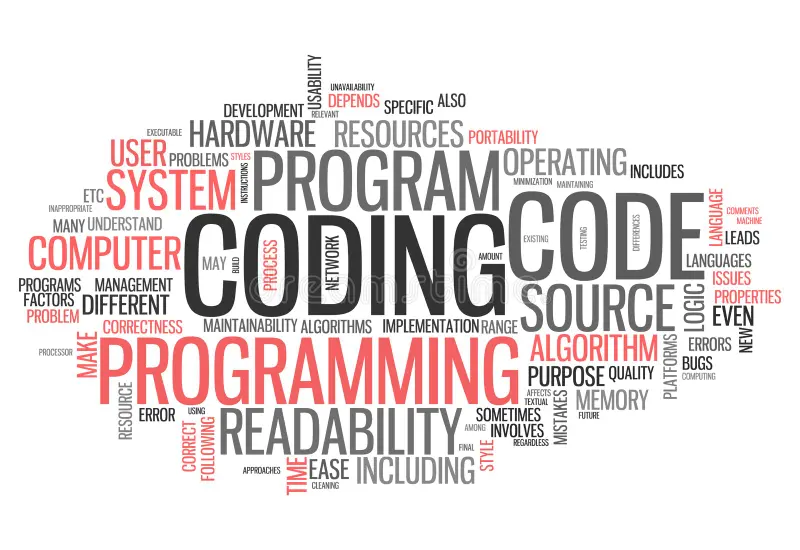

## Expectations
When I first learned that this course would cover TypeScript, I was very curious—curious about how it differs from JavaScript and what similarities they share. I had only taken an introductory JavaScript course before, and by the end of the semester I already felt confused and not particularly successful. Because of that, I expect this course will be an even bigger challenge for me.

When I first learned that this course would cover TypeScript, I was very curious—curious about how it differs from JavaScript and what similarities they share. I had only taken an introductory JavaScript course before, and by the end of the semester I already felt confused and not particularly successful. Because of that, I expect this course will be an even bigger challenge for me.

## WODs
This is my first time being introduced to the concept of WODs. That said, I think WODs are very helpful for learning a new language. They force my hands and brain to quickly get used to and become familiar with the syntax. Within a limited time, I have to outline my plan and then implement it, without too much hesitation. From the WODs I have done so far, each practice has felt like a challenge, and I can only barely finish within the Sd time. Still, I look forward to becoming more familiar as I continue, gradually speeding up and completing more difficult exercises. I am also excited about the upcoming content, and curious to see what kind of growth and changes I will have by the end of the semester.
