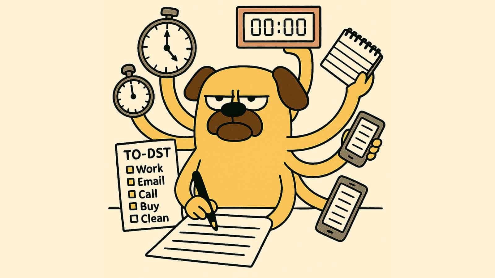

Working on effort estimation in the Mānoa Roomie Match project helped me think more clearly about how I spend my time. Instead of only focusing on whether an issue was finished, this project required me to estimate how much time each issue would take before I started working. Doing this made me more focused while working and more aware of how I used my time.

## How I estimated time

At the beginning of the project, I estimated time based on the task itself and my past experience with similar features. I usually broke an issue into frontend work, backend logic, and data handling. Based on how familiar I was with each part, I estimated how long the work might take.

As the project progressed, I became better at recognizing how different types of work affected time. Simple UI changes were often completed quickly. Features that involved authentication, data integration, or conditional logic usually took longer and required more testing. These experiences helped my later estimates feel closer to reality, even though they were not always exact.

Even when my estimates did not match the actual time spent, estimating ahead of time was still helpful. It encouraged me to set aside enough time before starting work. It also helped me identify which issues required more focus instead of being rushed.

## Tracking actual effort

During the project, I consistently tracked how much time I spent working by manually recording the start and end of each work session. When needed, I also checked version control history to help remember what I worked on during that time.

Tracking my time showed me that writing code was only part of the work. Debugging, testing, and making sure features worked correctly in different environments often took more time than writing the code itself. Knowing this helped me better estimate how much effort future tasks would require.

Toward the end of the project, multiple tasks were often happening at the same time, or I was making small changes across different parts of the application. Because of this, it became harder to assign time to a single issue. Even so, the overall tracking still showed where most of my effort was going.

## Future improvements

If I work on a similar project again, I would break issues into smaller tasks when estimating and tracking time. Smaller tasks are easier to plan and easier to manage if they start taking longer than expected.

I would also separate time spent on implementation, debugging, and testing when making estimates. That separation would make my planning more realistic and easier to control.

Overall, the biggest benefit of effort estimation was learning how to manage my pace and time more intentionally. This skill will be useful for long-term projects and future development work.

ChatGPT was used for grammar checking and wording adjustments.
