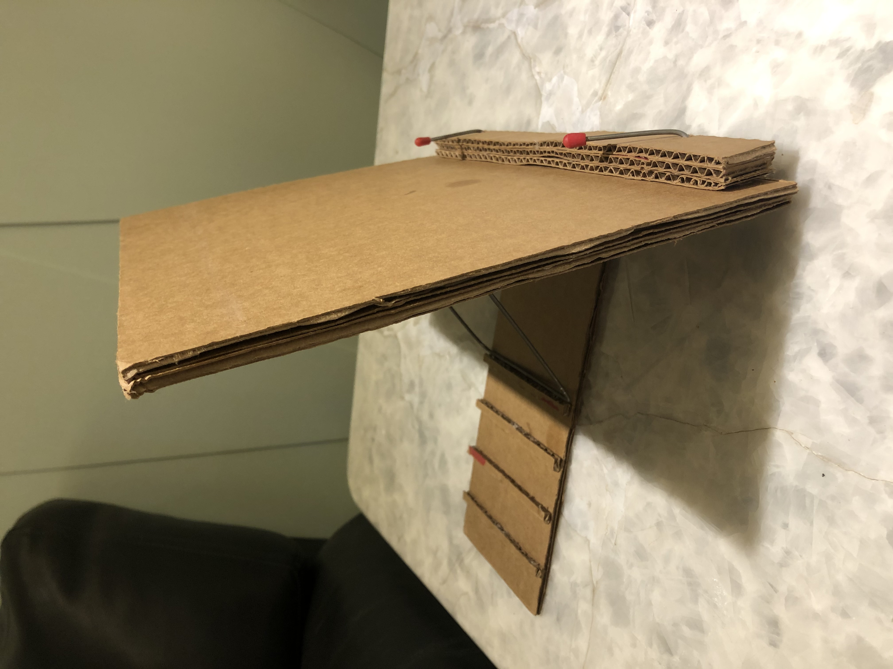
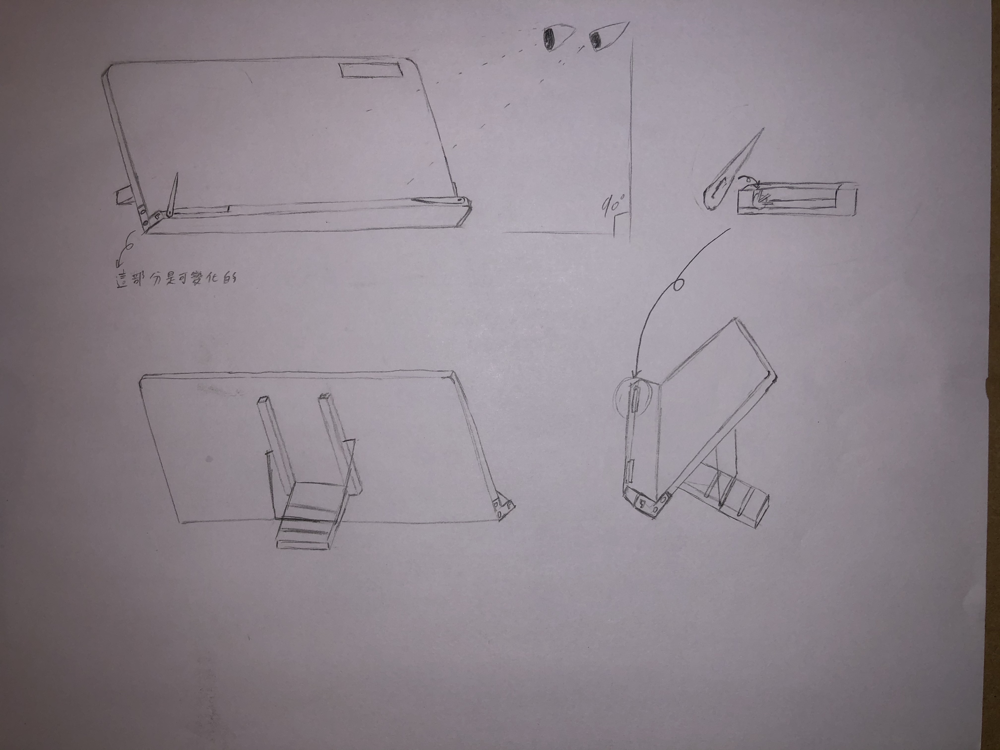
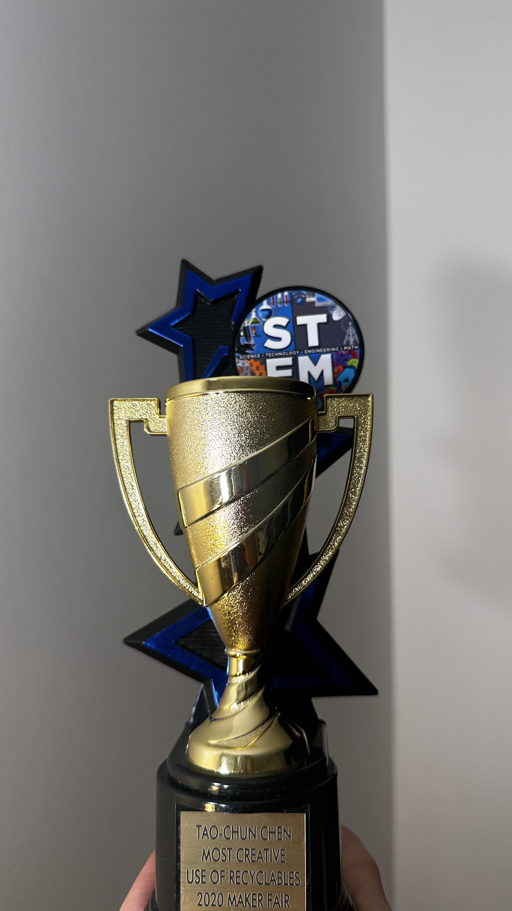

  
  
  

In high school, I participated in a STEM competition with my friends, where I was mainly responsible for product design and construction. My project was an adjustable-angle stand made from cardboard and metal parts, designed to hold books or a laptop. The idea was simple: to improve posture while studying at a desk, reduce slouching or looking down for long periods, and help prevent neck strain or discomfort. I brought this idea to life through a cardboard prototype and detailed design sketches.

Its value lay in combining ergonomics with simple materials. At that time in the United States, there were no adjustable stands specifically designed for students or readers, so we decided to use this opportunity to create one.

For me, this experience was more than just a competition—it was an attempt to design a product that could truly solve an everyday problem. From sketches to prototypes, I learned how to turn an idea into reality and realized that good design is not only about appearance but also about genuinely improving daily life.
