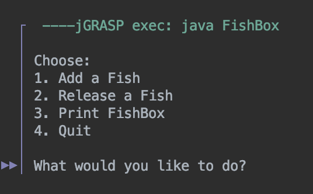

  
  
  

In last semester’s ICS 211 course, I completed a challenging project called FishBox. It was a modified binary search tree that not only stored fish species but also maintained a fishCount value in each node to track their quantities. This was the first time I realized that data structures often need to be adapted to real-world requirements, rather than simply copying the professor’s example code. It felt like I was truly solving problems based on needs, not just reproducing existing solutions.

In the project, I implemented IaNode and IaTree, and added custom exception classes to prevent invalid operations, such as trying to release more fish than I actually had. The most challenging part was recursion, especially in the remove function: when the count dropped to zero, the node had to be removed while still maintaining the correctness of the entire tree. I spent a significant amount of time understanding how the tree structure changes during this process, which gave me a much deeper grasp of recursion.

Although the final output was just a sorted list of fish species with their counts, this project gave me the sense that I had built a small-scale database. It strengthened my skills in object-oriented programming and recursion, while also reminding me that software design must take into account both error handling and maintainability.

You can view my code through this [link](https://github.com/ICSatKCC/assignment-8-binary-search-tree-f24-kcostales.git).
