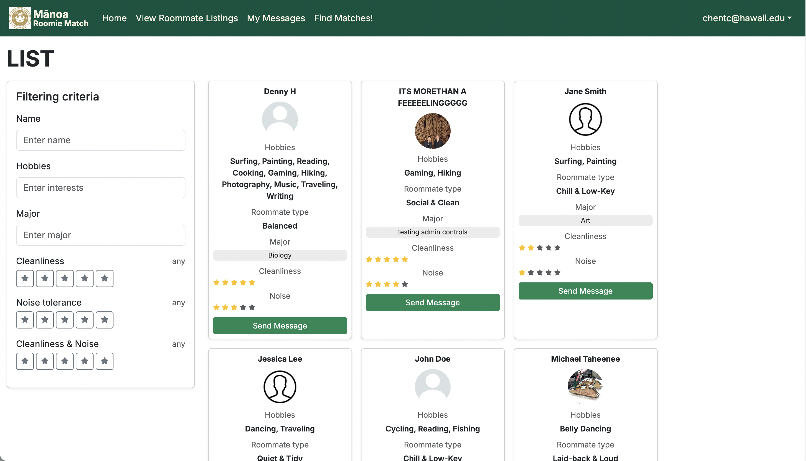
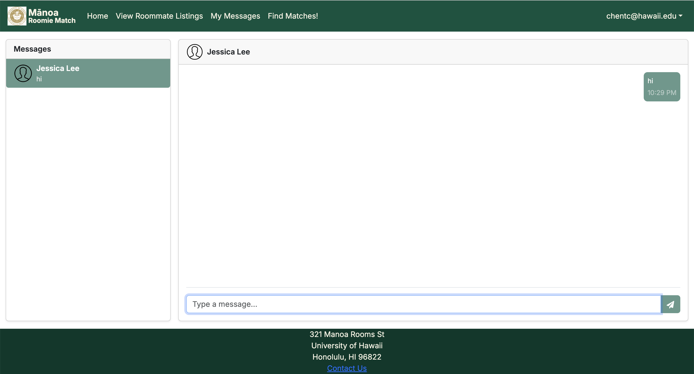

This project originally started as a required assignment for a university course, but as discussions became more active and ideas continued to grow, more features were added over time. In the end, it became the largest project I have worked on so far and the first one I was involved in that had a complete front end, back end, and user interface. I had worked on group projects before, but those were limited to local programs that could not be used through a website and did not include a full backend database. This project is a web application designed to help UH Mānoa students find compatible roommates based on their personal habits and preferences. Through this team development experience, I was able to truly experience the challenges of communication and system integration when multiple people work on the same project at the same time.

In this project, my main contributions were related to the messaging system. I worked on designing the chat interface, defining the data structures for messages, and connecting the messaging features to the database to ensure messages could be stored and displayed correctly. In addition to this, I also worked on a page that displays basic information for all users and added filtering features that allow users to search for roommates based on criteria such as name, interests, major, noise level, and cleanliness.

For communication, we used Discord and iMessage to discuss the project and coordinate our work. We also used class time each week to plan and assign tasks. GitHub was used for version control throughout the project. iMessage became our main communication tool because not everyone was online at the same time, and it allowed us to quickly discuss issues and respond to problems as they came up. This project helped me better understand how the front end, back end, and database work together, and it also showed me the importance of good data design and clear communication early in a team project. This page includes screenshots of the project, showcasing the chat feature and the roommate filtering system. For those interested in learning more, the project’s GitHub page is included for further reference.

  

    
  

  

    
  

