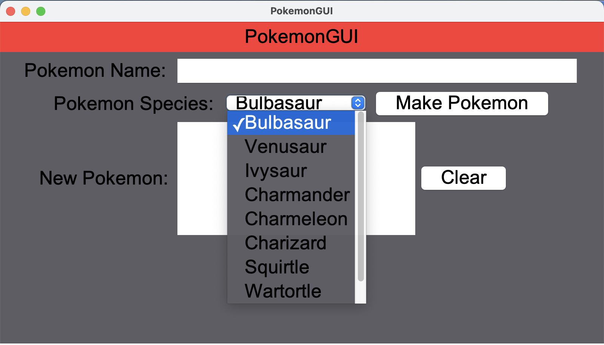
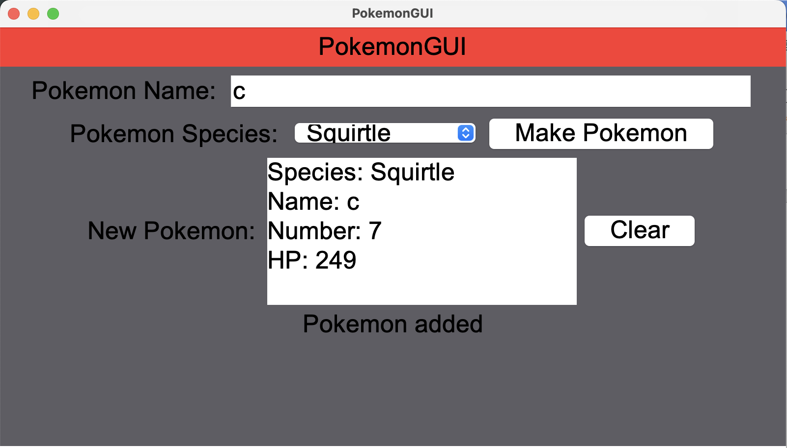
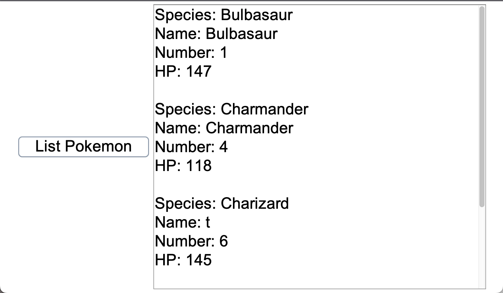

  
  
  

In the ICS 111 course, I completed a final project themed around a Pokémon Pokedex. The core class, PokemonByChentc, defined the attributes of a Pokémon (name, number, HP, etc.) and included error handling to prevent users from entering invalid values.

The most challenging part of the project was building a GUI using Java Swing. In Assignment12PanelChentc, I designed dropdown menus, text fields, and buttons that allowed users to add, clear, or list Pokémon. At first, I often ran into issues such as the screen not refreshing or buttons not responding, but through repeated testing and debugging, I gradually learned how to think in terms of event-driven design.

Although the project was not large in scale, it taught me how to transform code into a real application that users can interact with.

You can view my code through this [link](https://github.com/chentcthomas/pokemon.git).
